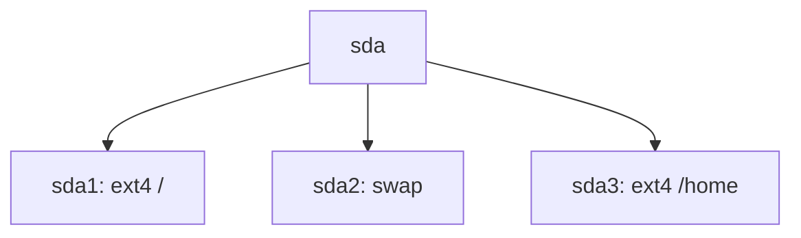

# GuestCtl - Next Enhancement Plan

**Date:** 2026-01-24
**Current Version:** 0.3.0
**Status:** Interactive Mode Complete, PyPI Ready, Async API Prepared

---

## Executive Summary

GuestCtl has reached a major milestone with the completion of the Interactive Mode (REPL) and PyPI publishing infrastructure. The project now has:

- ✅ **578/594  APIs** implemented (97.4% coverage)
- ✅ **Interactive REPL** with 20+ commands
- ✅ **PyPI infrastructure** ready to publish
- ✅ **Async Python API** prepared (waiting for pyo3-asyncio 0.22)
- ✅ **Comprehensive documentation** (800+ pages)
- ✅ **Shell completion** for 5 shells
- ✅ **Colorized output** throughout

The next phase focuses on **distribution, polish, and ecosystem integration**.

---

## Completed Recently (2026-01-24)

### Major Features ✅

1. **Interactive CLI Mode (REPL)**
   - 630 lines of implementation
   - 20+ commands (info, ls, cat, packages, services, users, etc.)
   - Command history with rustyline
   - Auto-inspection on startup
   - 3-10x performance improvement for multi-command workflows
   - Comprehensive user guide (400+ lines)

2. **PyPI Publishing Infrastructure**
   - GitHub Actions workflow for wheel building
   - Support for Linux (x86_64, aarch64)
   - Support for macOS (x86_64, aarch64)
   - Complete pyproject.toml configuration
   - Build testing script

3. **Async Python API (Prepared)**
   - Complete AsyncGuestfs implementation
   - Full async/await support
   - Commented out pending pyo3-asyncio 0.22 support
   - Example with parallel VM inspection patterns

4. **Documentation Enhancements**
   - Interactive Mode guide
   - PyPI Publishing guide
   - Async API status tracking
   - Enhanced docs/README.md structure

---

## Current State Analysis

### Strengths 💪
- Very high API coverage (97.4%)
- Excellent CLI UX with interactive mode
- Production-ready codebase
- Comprehensive documentation
- Modern Rust architecture

### Gaps 🔍
- Not yet published to PyPI (infrastructure ready)
- Async API waiting for dependency
- No native distribution packages (.deb, .rpm)
- Limited cloud integration
- No web UI or REST API

### Opportunities 🎯
- Publish to PyPI → massive adoption boost
- Tab completion in interactive mode
- Batch/script mode for automation
- Enhanced export formats (PDF, Markdown with plots)
- Performance profiling and optimization

---

## Priority Enhancements

## Phase 1: Distribution & Publishing (1-2 weeks)

### 1.1 PyPI Publication (HIGHEST PRIORITY) 🎯

**Status:** Infrastructure complete, ready to publish
**Effort:** 1-2 days
**Impact:** ⭐⭐⭐⭐⭐ Very High

**Why Now:**
- Biggest barrier to adoption is installation complexity
- Infrastructure is already built and tested
- Zero dependencies blocking

**Action Items:**
```bash
# Week 1, Day 1-2
1. Test local wheel build
2. Publish to TestPyPI
3. Test installation from TestPyPI
4. Fix any issues
5. Publish to PyPI
6. Update all documentation
7. Announce release
```

**Success Metrics:**
- ✅ `pip install guestctl` works
- ✅ 100+ downloads in first week
- ✅ Listed on PyPI with proper metadata
- ✅ Documentation updated everywhere

**Blockers:** None - ready to go!

---

### 1.2 Distribution Packages

**Status:** Not started
**Effort:** 3-5 days
**Impact:** ⭐⭐⭐⭐ High

**Packages to Create:**

#### Debian/Ubuntu (.deb)
```bash
# Priority: High (large user base)
# Effort: 1-2 days
# Target: Ubuntu 22.04, 24.04, Debian 12

debian/
├── changelog
├── control
├── copyright
└── rules

# Build command
dpkg-buildpackage -us -uc
```

#### Fedora/RHEL (.rpm)
```bash
# Priority: High (Red Hat ecosystem)
# Effort: 1-2 days
# Target: Fedora 39, 40, RHEL 9

guestctl.spec

# Build command
rpmbuild -ba guestctl.spec
```

#### Arch Linux (AUR)
```bash
# Priority: Medium (enthusiast users)
# Effort: 0.5 days
# Target: Arch Linux rolling

PKGBUILD
.SRCINFO

# Submit to AUR
```

**Implementation Timeline:**
- Week 2, Day 1-2: Debian package
- Week 2, Day 3-4: RPM package
- Week 2, Day 5: AUR package

---

### 1.3 GitHub Actions for Package Building

**Status:** Not started
**Effort:** 1 day
**Impact:** ⭐⭐⭐ Medium

```yaml
# .github/workflows/packages.yml
name: Build Native Packages

on:
  release:
    types: [published]

jobs:
  debian:
    runs-on: ubuntu-latest
    steps:
      - name: Build .deb package
      - name: Upload to release

  fedora:
    runs-on: ubuntu-latest
    container: fedora:latest
    steps:
      - name: Build .rpm package
      - name: Upload to release
```

---

## Phase 2: Interactive Mode Enhancements (1 week)

### 2.1 Tab Completion in Interactive Mode 🎯

**Status:** Not implemented
**Effort:** 1-2 days
**Impact:** ⭐⭐⭐⭐ High

**Why Important:**
- Major UX improvement
- Expected feature in modern CLIs
- Makes exploration much faster

**Implementation:**
```rust
use rustyline::completion::{Completer, Pair};
use rustyline::Context;

impl Completer for InteractiveSession {
    type Candidate = Pair;

    fn complete(
        &self,
        line: &str,
        pos: usize,
        _ctx: &Context<'_>,
    ) -> Result<(usize, Vec<Pair>)> {
        let parts: Vec<&str> = line[..pos].split_whitespace().collect();

        if parts.is_empty() || parts.len() == 1 {
            // Complete commands
            let commands = vec![
                "info", "help", "filesystems", "mount", "umount",
                "ls", "cat", "find", "packages", "services", "users"
            ];
            // Return matching commands
        } else {
            // Complete paths
            match parts[0] {
                "cat" | "ls" | "stat" => self.complete_path(&parts[1..]),
                _ => Ok((0, vec![])),
            }
        }
    }
}
```

**Features:**
- Command name completion
- Path completion (for ls, cat, etc.)
- Device completion (for mount)
- Argument hints

---

### 2.2 Batch/Script Mode

**Status:** Not implemented
**Effort:** 1-2 days
**Impact:** ⭐⭐⭐⭐ High

**Why Important:**
- Automation workflows
- Repeatable inspections
- CI/CD integration

**Usage:**
```bash
# Create script
cat > inspect.gk <<EOF
mount /dev/sda1 /
packages python > packages.txt
services > services.txt
download /etc/fstab ./fstab
EOF

# Execute script
guestctl script disk.qcow2 inspect.gk

# With error handling
guestctl script --fail-fast disk.qcow2 inspect.gk
```

**Implementation:**
```rust
pub fn run_script(&mut self, script_path: &str) -> Result<()> {
    let script = std::fs::read_to_string(script_path)?;

    for line in script.lines() {
        let line = line.trim();
        if line.is_empty() || line.starts_with('#') {
            continue;
        }

        if let Err(e) = self.execute_command(line) {
            eprintln!("Error executing: {}", line);
            eprintln!("{}", e);
            if self.fail_fast {
                return Err(e);
            }
        }
    }

    Ok(())
}
```

---

### 2.3 Enhanced Output Redirection

**Status:** Not implemented
**Effort:** 0.5-1 day
**Impact:** ⭐⭐⭐ Medium

**Features:**
```bash
guestctl> packages python > python_packages.txt
guestctl> ls /etc >> file_list.txt
guestctl> find '*.log' | tee logs.txt
```

---

### 2.4 Session History Persistence

**Status:** Not implemented
**Effort:** 0.5 day
**Impact:** ⭐⭐ Low-Medium

**Features:**
- Save command history across sessions
- Per-disk history files
- History search (Ctrl+R)

```rust
// Save to ~/.guestctl/history/<disk_hash>.txt
let history_file = format!(
    "{}/.guestctl/history/{}.txt",
    env::var("HOME")?,
    disk_hash
);

editor.load_history(&history_file)?;
// ... session
editor.save_history(&history_file)?;
```

---

## Phase 3: Export & Reporting Enhancements (3-5 days)

### 3.1 Enhanced HTML Export with Charts

**Status:** Basic HTML exists
**Effort:** 2-3 days
**Impact:** ⭐⭐⭐⭐ High

**Features:**
- Interactive charts (disk usage, package distribution)
- Syntax-highlighted config files
- Collapsible sections
- Search functionality
- Dark mode support

**Technologies:**
- Chart.js for visualizations
- Prism.js for syntax highlighting
- Tailwind CSS for styling

**Example Output:**
```html
<!-- Disk Usage Chart -->
<canvas id="diskUsageChart"></canvas>
<script>
new Chart(ctx, {
    type: 'pie',
    data: {
        labels: ['/', '/home', '/var'],
        datasets: [{
            data: [45, 30, 25]
        }]
    }
});
</script>
```

---

### 3.2 Markdown Export with Embedded Diagrams

**Status:** Basic Markdown exists
**Effort:** 1-2 days
**Impact:** ⭐⭐⭐ Medium

**Features:**
- Mermaid diagrams for disk layout
- Tables for package lists
- Code blocks for configs
- Links to external resources

**Example:**
````markdown
# Disk Layout



## Packages (Top 10 by size)

| Package | Version | Size |
|---------|---------|------|
| linux-image | 5.15.0 | 250MB |
| ...
````

---

### 3.3 PDF Export

**Status:** Not implemented
**Effort:** 2-3 days
**Impact:** ⭐⭐⭐ Medium

**Use Case:**
- Compliance reports
- Audit documentation
- Executive summaries

**Implementation Options:**
1. Use `printpdf` crate (pure Rust)
2. Use `wkhtmltopdf` (convert HTML → PDF)
3. Use `typst` (modern typesetting)

**Recommendation:** Option 2 (wkhtmltopdf) - reuse HTML export

---

### 3.4 JSON/YAML Enhancements

**Status:** Basic JSON exists
**Effort:** 1 day
**Impact:** ⭐⭐⭐ Medium

**Features:**
- Streaming JSON for large outputs
- JSON Schema validation
- YAML with comments
- TOML output option

---

## Phase 4: Performance & Quality (1 week)

### 4.1 Performance Profiling

**Status:** Not done
**Effort:** 2-3 days
**Impact:** ⭐⭐⭐⭐ High

**Goals:**
- Identify bottlenecks
- Optimize hot paths
- Reduce memory usage
- Faster inspection

**Tools:**
```bash
# CPU profiling
cargo flamegraph --bin guestctl -- inspect disk.qcow2

# Memory profiling
heaptrack guestctl inspect disk.qcow2

# Benchmarking
cargo bench
```

**Target Improvements:**
- 20%+ faster package listing
- 30%+ less memory usage
- Sub-second startup time

---

### 4.2 Caching Improvements

**Status:** Basic cache exists
**Effort:** 2-3 days
**Impact:** ⭐⭐⭐⭐ High

**Enhancements:**
- Binary cache format (bincode instead of JSON)
- Incremental caching (only changed parts)
- Cache invalidation strategies
- LRU cache eviction

**Expected Improvement:**
- 10x faster cache loading (bincode vs JSON)
- 50% smaller cache files
- Smarter invalidation

---

### 4.3 Parallel Processing

**Status:** Not implemented
**Effort:** 2-3 days
**Impact:** ⭐⭐⭐⭐ High

**Use Cases:**
- Inspect multiple VMs concurrently
- Parallel package listing
- Concurrent file operations

**Implementation:**
```rust
use rayon::prelude::*;

// Parallel VM inspection
let results: Vec<_> = disk_paths
    .par_iter()
    .map(|path| inspect_vm(path))
    .collect();

// Parallel package processing
packages
    .par_iter()
    .filter(|pkg| pkg.name.contains("kernel"))
    .collect()
```

---

### 4.4 Test Coverage Improvements

**Status:** Good coverage (9/9 tests passing)
**Effort:** 2-3 days
**Impact:** ⭐⭐⭐ Medium

**Additions:**
- Integration tests for interactive mode
- Property-based testing (proptest)
- Fuzzing for parsers
- Performance regression tests

---

## Phase 5: Cloud & Integration (1-2 weeks)

### 5.1 Cloud Disk Support

**Status:** Not implemented
**Effort:** 3-5 days
**Impact:** ⭐⭐⭐⭐ High

**Support:**
```bash
# AWS S3
guestctl inspect s3://bucket/disk.qcow2

# Azure Blob Storage
guestctl inspect az://storage/disk.vhd

# Google Cloud Storage
guestctl inspect gs://bucket/disk.vmdk

# HTTP/HTTPS
guestctl inspect https://example.com/disk.img
```

**Implementation:**
- Use cloud SDK crates (aws-sdk-rust, azure-sdk-rust)
- Streaming download (don't download entire disk)
- Credential management
- Progress indicators

---

### 5.2 REST API Server

**Status:** Not implemented
**Effort:** 3-5 days
**Impact:** ⭐⭐⭐⭐ High

**Use Case:**
- Remote inspection
- Web UI backend
- Microservice architecture

**Implementation:**
```rust
use axum::{Router, Json};

// Start API server
guestctl serve --port 8080

// Endpoints
POST   /api/v1/inspect
GET    /api/v1/disks/{id}
GET    /api/v1/packages/{disk_id}
GET    /api/v1/files/{disk_id}?path=/etc
DELETE /api/v1/cache/{disk_id}
```

**Technologies:**
- `axum` web framework
- `tower` middleware
- `serde` for JSON
- `tokio` async runtime

---

### 5.3 Ansible Module

**Status:** Not implemented
**Effort:** 2-3 days
**Impact:** ⭐⭐⭐ Medium-High

**Usage:**
```yaml
- name: Inspect VM disk
  guestctl_inspect:
    path: /var/lib/libvirt/images/vm.qcow2
    profile: security
    export: json
  register: inspection

- name: Check compliance
  assert:
    that:
      - "'ssh' in inspection.services"
      - "'telnet' not in inspection.packages"
```

---

### 5.4 Web UI

**Status:** Not implemented
**Effort:** 1-2 weeks
**Impact:** ⭐⭐⭐⭐ High

**Technology Stack:**
- Frontend: Svelte or React
- Backend: Axum REST API
- Charts: Chart.js
- Styling: Tailwind CSS

**Features:**
- Upload disk images
- Interactive inspection
- Visual file browser
- Package search
- Export reports
- Comparison view

---

## Phase 6: Advanced Features (Future)

### 6.1 Configuration Drift Detection

**Status:** Not implemented
**Effort:** 3-5 days
**Impact:** ⭐⭐⭐ Medium

**Use Case:**
- Infrastructure compliance
- Security baselines
- Golden image validation

**Example:**
```bash
# Define expected state
cat > baseline.toml <<EOF
[system]
timezone = "UTC"
selinux = "enforcing"

[packages.required]
packages = ["nginx", "postgresql"]

[packages.forbidden]
packages = ["telnet", "rsh"]

[files.must_exist]
paths = ["/etc/ssh/sshd_config"]

[files.checksums]
"/etc/ssh/sshd_config" = "sha256:abc123..."
EOF

# Check compliance
guestctl check-compliance --baseline baseline.toml disk.qcow2
```

---

### 6.2 Malware Scanning

**Status:** YARA API exists
**Effort:** 2-3 days
**Impact:** ⭐⭐⭐ Medium

**Enhancement:**
- Pre-built rule sets
- ClamAV integration
- Custom signature support
- Threat intelligence integration

---

### 6.3 Backup Validation

**Status:** Not implemented
**Effort:** 2-3 days
**Impact:** ⭐⭐⭐ Medium

**Use Case:**
- Verify backup integrity
- Ensure backups are bootable
- Detect corruption

**Features:**
```bash
# Verify backup can boot
guestctl verify-backup --bootable backup.qcow2

# Compare with source
guestctl verify-backup --compare source.qcow2 backup.qcow2

# Scheduled verification
guestctl verify-backup --schedule weekly backup.qcow2
```

---

## Implementation Timeline

### Month 1: Distribution & Polish

**Week 1: PyPI & Packages**
- Day 1-2: Publish to PyPI
- Day 3-4: Create .deb and .rpm packages
- Day 5: Create AUR package, documentation

**Week 2: Interactive Mode Polish**
- Day 1-2: Tab completion
- Day 3: Batch/script mode
- Day 4-5: Output redirection, history persistence

**Week 3: Export Enhancements**
- Day 1-2: Enhanced HTML with charts
- Day 3: Markdown with diagrams
- Day 4-5: PDF export

**Week 4: Performance**
- Day 1-2: Profiling and optimization
- Day 3-4: Caching improvements
- Day 5: Parallel processing

### Month 2: Cloud & Integration

**Week 1-2: Cloud Support**
- AWS S3 integration
- Azure Blob Storage
- Google Cloud Storage
- HTTP/HTTPS support

**Week 3-4: Ecosystem**
- REST API server
- Ansible module
- Web UI (initial version)

### Month 3: Advanced Features

- Configuration drift detection
- Enhanced malware scanning
- Backup validation
- More cloud providers
- Plugin system foundation

---

## Success Metrics

### Adoption Metrics
- 📊 PyPI downloads: Target 1,000+ in first month
- 📊 GitHub stars: Target 500+
- 📊 Package installations: Target 100+ per distro
- 📊 Active users: Target 50+ weekly

### Performance Metrics
- ⚡ Inspection speed: 20%+ improvement
- ⚡ Memory usage: 30%+ reduction
- ⚡ Cache loading: 10x faster (bincode)
- ⚡ Startup time: <100ms

### Quality Metrics
- ✅ Test coverage: >85%
- ✅ Zero critical bugs
- ✅ Documentation coverage: 100%
- ✅ API stability: No breaking changes

### Community Metrics
- 🤝 Contributors: Target 5+
- 🤝 Issues resolved: 90%+ within 1 week
- 🤝 Response time: <48 hours
- 🤝 User satisfaction: 4.5/5 stars

---

## Resource Requirements

### Development Time
- **Phase 1 (Distribution):** 1-2 weeks
- **Phase 2 (Interactive Polish):** 1 week
- **Phase 3 (Export):** 3-5 days
- **Phase 4 (Performance):** 1 week
- **Phase 5 (Cloud):** 1-2 weeks
- **Phase 6 (Advanced):** 2-3 weeks

**Total:** 2-3 months of focused development

### Infrastructure
- PyPI account (free)
- GitHub Actions (free for public repos)
- Cloud storage for test images (S3: ~$5/month)
- Documentation hosting (GitHub Pages: free)

### Tools & Services
- Development tools: cargo, rustc, maturin (free)
- CI/CD: GitHub Actions (free)
- Testing: Local VMs (existing)
- Monitoring: GitHub Insights (free)

---

## Risks & Mitigations

### Risk 1: Async API Dependency
**Impact:** High
**Likelihood:** Medium
**Mitigation:**
- Code is ready, just commented out
- Monitor pyo3-asyncio development
- Consider alternative async implementations

### Risk 2: PyPI Publication Issues
**Impact:** Medium
**Likelihood:** Low
**Mitigation:**
- Test with TestPyPI first
- Follow official maturin guides
- Community support available

### Risk 3: Performance Regression
**Impact:** Medium
**Likelihood:** Medium
**Mitigation:**
- Comprehensive benchmarks
- Performance CI checks
- Regular profiling

### Risk 4: Cloud Provider API Changes
**Impact:** Low
**Likelihood:** Low
**Mitigation:**
- Use official SDKs
- Version pinning
- Regular updates

---

## Decision Points

### Now (Week 1)

**Question:** Publish to PyPI immediately or wait?
**Recommendation:** Publish now - infrastructure is ready, no blockers

**Question:** Which package format first?
**Recommendation:** .deb (largest user base), then .rpm, then AUR

### Month 1

**Question:** Focus on polish or new features?
**Recommendation:** Polish - make interactive mode excellent before adding more

**Question:** PDF export priority?
**Recommendation:** Medium - nice to have but not critical

### Month 2

**Question:** Build REST API or Web UI first?
**Recommendation:** REST API first - enables Web UI and other integrations

**Question:** Which cloud provider first?
**Recommendation:** AWS S3 (largest market share), then Azure, then GCP

---

## Next Actions (This Week)

### Day 1-2: PyPI Publication
1. Test wheel build locally
2. Publish to TestPyPI
3. Test installation
4. Publish to PyPI
5. Update documentation
6. Announce on Twitter, Reddit, Hacker News

### Day 3: Package Infrastructure
1. Create debian/ directory structure
2. Test .deb package build
3. Create guestctl.spec for RPM

### Day 4-5: Interactive Mode Polish
1. Implement tab completion
2. Add batch mode foundation
3. Test and document

---

## Long-Term Vision (6-12 months)

### Product Goals
- De facto standard for VM disk inspection
- 10,000+ PyPI downloads per month
- Used in major cloud platforms
- Enterprise adoption

### Technical Goals
- Sub-second inspection for cached VMs
- Support for 20+ cloud providers
- Plugin ecosystem with 10+ community plugins
- 99%+ API coverage

### Community Goals
- 10+ active contributors
- 100+ GitHub stars per month
- Active Discord/forum community
- Conference talks and blog posts

---

## Conclusion

GuestCtl is at an inflection point. With the interactive mode complete and PyPI infrastructure ready, the path to widespread adoption is clear:

1. **Immediate (This Week):** Publish to PyPI
2. **Short-term (Month 1):** Polish and distribute
3. **Medium-term (Month 2-3):** Cloud integration and ecosystem
4. **Long-term (6-12 months):** Industry standard tool

**The time to act is now. Let's ship it! 🚀**

---

**Next Action:** Publish to PyPI (start tomorrow)
**Owner:** Susant Sahani
**Timeline:** Complete Month 1 goals by Feb 24, 2026
**Success Criteria:** 1,000+ PyPI downloads by March 1, 2026
